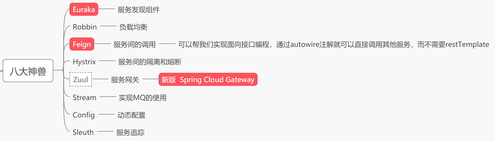
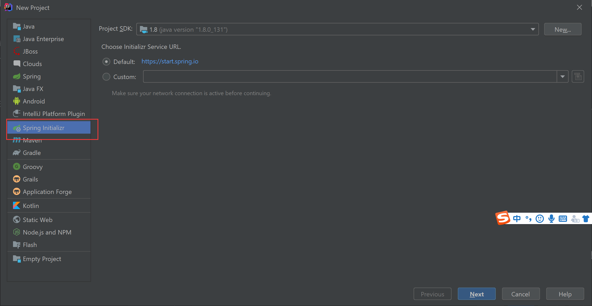
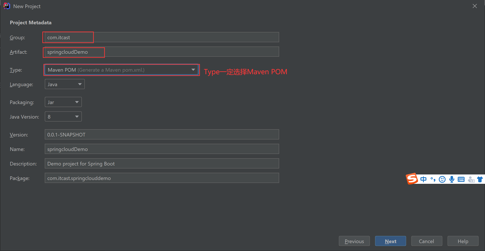
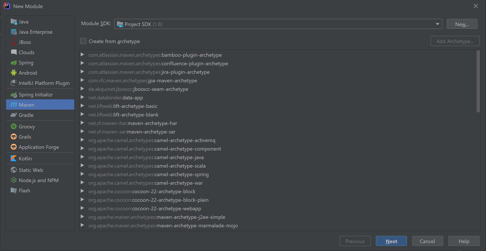
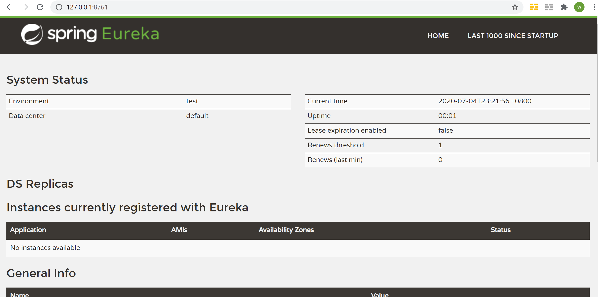
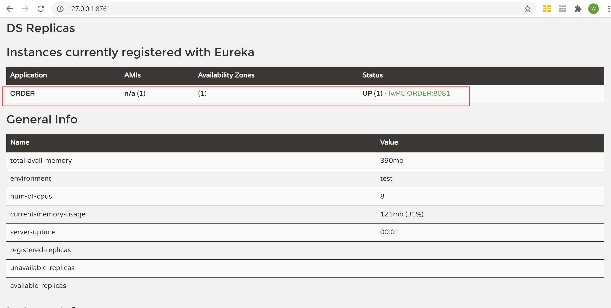
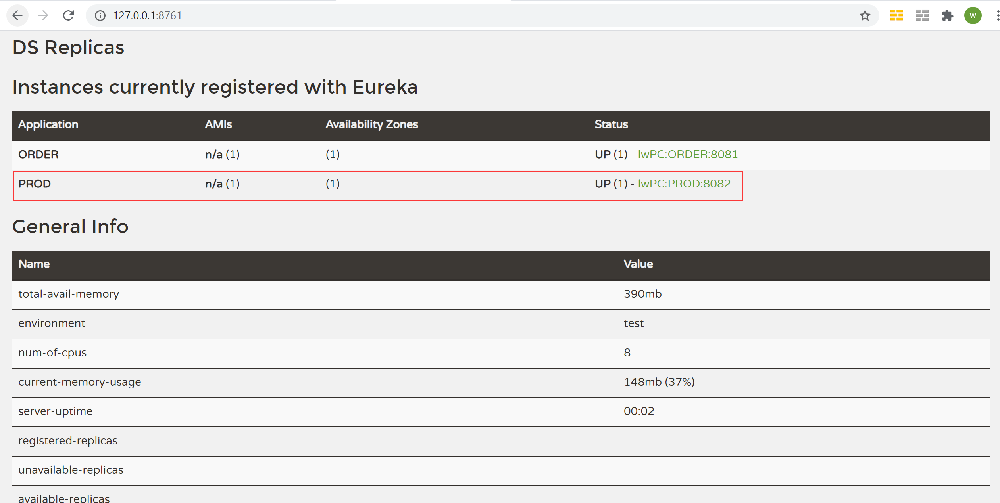
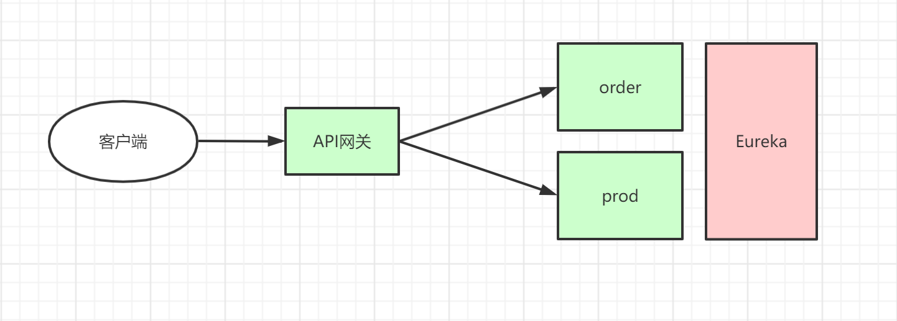

# springcloud入门

## 一、微服务简介

### 1、微服务架构概念的提出


**“monolithic 系统"的问题点：**

> 1. 对整个系统的一个小地方的改动，都要对整个系统重新build 和 deploy
> 2. 做scale的时候，扩充的是整个系统，而不是整个系统中最需要扩容的那个点。

**解决方案---微服务**

> https://www.martinfowler.com/microservices/

> In short, the microservice architectural style is an approach to developing a single application as a **suite of small services**, each **running in its own process** and communicating with      lightweight mechanisms, often an HTTP resource API. These      services are **built around business capabilities** and      **independently deployable** by fully automated deployment      machinery. There is a **bare minimum of centralized management** of      these services, which may be written in different programming languages and use different data storage technologies.
>
> -- [James Lewis and Martin Fowler (2014)](https://www.martinfowler.com/articles/microservices.html)
>
> 简单地说， 微服务是系统架构上的一种==设计风格==， 它的主旨是将一个原本独立的系统==拆分成多个小型服务==，这些小型服务都在==各自独立==的进程中运行，服务之间通过基于 ==HTTP 的 RESTful API== 进行通信协作；被拆分后的每一个小型服务都==围绕着系统中的某一项业务==功能进行构建， 并且每个服务都是一个==单独部署==的项目，可以进行独立的测试、开发和部署等；由于各个独立的服务之间使用的是基于 HTTP 的 JSON 作为数据通信协作的基础，所以这些微服务可以使用==不同的语言==来开发；


> - Componentization via Services  --服务组件化
> - Organized around Business Capabilities --围绕业务能力进行组织
> - Products not Projects --产品而不是项目
> - Smart endpoints and dumb pipes --
> - Decentralized Governance -- 去中心化的治理
> - Decentralized Data Management --去中心化的数据管理
> - Infrastructure Automation --基础设施自动化
> - Design for failure -- 容错性设计
> - Evolutionary Design -- 扩展性设计


### 2、springcloud

> 1、springcloud是微服务架构落地的一个技术栈。
>
> 2、springcloud中的大多数技术是基于NetFlix公司的技术进行二次研发。
>
> 3、八大神兽
>
> 
>
> 
>
> 4、参考网站：
>
> springcloud中文社区网站：http://springcloud.cn/
>
> springcloud中文网：https://www.springcloud.cc/


## 二、项目实战

### 1、需求描述

> 1、注册中心：springcloud eureka
>
> 2、订单Oder服务、商品Prod服务。
>
> 3、网关服务：springcloud gateway。
>
> 4、订单服务远程调用商品服务。

### 2、工程框架搭建

#### 2.1 创建一个父工程

> 1、开启idea，Create New Project，选择类型Spring Initializr
>
> 2、填写父工程信息。注意：Type选择**Maven POM**。
>
> 3、声明springcloud版本。
>
> https://spring.io/projects/spring-cloud   [reach end-of-life](https://spring.io/blog/2018/06/19/spring-cloud-finchley-release-is-available)
>
> ```xml
> <dependencyManagement>
>     <dependencies>
>         <dependency>
>             <groupId>org.springframework.cloud</groupId>
>             <artifactId>spring-cloud-dependencies</artifactId>
>             <version>Hoxton.SR6</version>
>             <type>pom</type>
>             <scope>import</scope>
>         </dependency>
>     </dependencies>
> </dependencyManagement>
> ```

#### 2.2 新建EurekaServer模块

> 1. 新建module
>
> 
>
> 2、引入eureka server的依赖
>
> Spring Cloud Netflix > 文档 > 2. Service Discovery: Eureka Server
>
> ```xml
> <dependency>
>     <groupId>org.springframework.cloud</groupId>
>     <artifactId>spring-cloud-starter-netflix-eureka-server</artifactId>
> </dependency>
> ```
>
> ②eureka子模块也属于spring-boot项目，所以也要引入
>
> ```xml
> <dependency>
>     <groupId>org.springframework.boot</groupId>
>     <artifactId>spring-boot-starter-web</artifactId>
> </dependency>
> ```
>
> 3、编写启动类
>
> ```java
> @SpringBootApplication
> @EnableEurekaServer
> public class EurekaApplication {
> 
>     public static void main(String[] args) {
>         SpringApplication.run(EurekaApplication.class, args);
>     }
> }
> ```
>
> 
>
> 4、引入配置文件application.yml
>
> ```yml
> server:
>   port: 8761  #服务的端口号
> 
> eureka:
>   instance:
>     hostname: localhost
>   client:
>     registerWithEureka: false  # 单机版，暂时指定为false
>     fetchRegistry: false
>     serviceUrl:
>       defaultZone: http://${eureka.instance.hostname}:${server.port}/eureka/
> ```
>
> 5、测试
>
> 

#### 2.4新建Order模块

> 1. 新建module
>
>    命名：03-Order
>
> 2. 引入eureka client依赖
>
>    ```xml
>    <dependency>
>        <groupId>org.springframework.cloud</groupId>
>        <artifactId>spring-cloud-starter-netflix-eureka-client</artifactId>
>    </dependency>
>    ```
>
> 3. 编写启动类以及接口
>
>    类推
>
> 4. 引入配置文件application.yml
>
>    ```yml
>    # 制定eureka服务地址
>    eureka:
>      client:
>        service-url:
>          defaultZone: http://localhost:8761/eureka
>    
>    #本服务名称
>    spring:
>      application:
>        name: ORDER
>    
>    #修改端口号
>    server:
>      port: 8081
>    ```
>
> 5. 测试
>
>    

#### 2.5新建Prod模块

> 1. 新建module
>
>    命名：03-Order
>
> 2. 引入eureka client依赖
>
>    同order
>
> 3. 编写启动类
>
>    类推
>
> 4. 引入配置文件Application.yml
>
>    ```yml
>    # 制定eureka服务地址
>    eureka:
>      client:
>        service-url:
>          defaultZone: http://localhost:8761/eureka
>    
>    #本服务名称
>    spring:
>      application:
>        name: PROD
>    
>    #修改端口号
>    server:
>      port: 8082
>    ```
>
> 5. 测试
>
>    

### 3、feign的引入

#### 3.1、引言

> feign可以帮助我们实现面向接口编程，直接调用其他服务，简化开发。

#### 3.2、添加Feign的支持

> 1. 导入依赖
>
>    Netflex平级的，Spring Cloud OpenFeign，
>
>    注意：是在调用方Order中导入依赖。	
>
>    ```xml
>    <dependency>
>        <groupId>org.springframework.cloud</groupId>
>        <artifactId>spring-cloud-starter-openfeign</artifactId>
>    </dependency>
>    ```
>
> 2. 添加一个注解
>
>    ==@EnableFeignClients==
>
>    ```java
>    @SpringBootApplication
>    @EnableEurekaClient
>    @EnableFeignClients
>    public class OrderApplication {
>        public static void main(String[] args) {
>            SpringApplication.run(OrderApplication.class, args);
>        }
>    
>    }
>    ```
>
> 3. 创建一个接口，并且和Prod模块做映射
>
>    注意：客户端中不可以使用@GetMapping，必须使用==@RequestMapping==
>
>    ```java
>    @FeignClient("PROD")
>    public interface ProdClient {
>        @RequestMapping(value="/searchProd/{orderId}",method = RequestMethod.GET)
>        Prod searchProd(@PathVariable(value="orderId") Integer orderId);
>    }
>    ```
>    
>    
>    
> 4. 测试使用
>
> 略


### 4、GateWay引入

#### 3.1、引言

> zuul开源跳票严重，Spring组织就自己开发了一套服务网关来取代zuul。
>
> ==**路由：**==这是网关的基本构建快，它由一个ID，一个目标URI一组断言和一族过滤器定义。如果断言为真，则路由匹配。
>
> ==**Predicate（断言）**==：这是一个Java8的Predicate，输入类型是一个ServerWebExchange。我们可以用它来匹配来自HTTP请求的任何内容，例如headers或者参数。
>
> ==**Filter（过滤器）**==：这是GatewayFilter的实例，我们可以用他修改请求和响应。
>
> 
>
> 

#### 3.2、添加gateway的支持

1、导入依赖

> Netflex平级的，[Spring Cloud Gateway](https://spring.io/projects/spring-cloud-gateway)
>
> ```xml
> <dependency>
>     <groupId>org.springframework.cloud</groupId>
>     <artifactId>spring-cloud-starter-gateway</artifactId>
> </dependency>
> ```

> 注意：springMvc和gateway中的webFlux是有冲突的，要注意排查。

2、配置文件

> ```yml
> #网关服务端口
> server:
>   port: 9002
> 
> #服务名
> spring:
>   application:
>     name: GATEWAY
>   cloud:
>     gateway:
>       routes:
>         #路由1
>         - id: order_route1
>           uri: http://localhost:8081
>           predicates:
>             - Path=/**
>             - After=2017-01-20T17:42:47.789-07:00[America/Denver]
> 
> #网关日志配置
> logging:
>   level:
>     org.springframework.cloud.gateway: TRACE
>     org.springframework.http.server.reactive: DEBUG
>     org.springframework.web.reactive: DEBUG
>     reactor.ipc.netty: DEBUG
>     reactor.netty: DEBUG
> ```

### 5、mybatis引入

#### 3.1、引言

> 

#### 3.2、mybatis引入

https://docs.spring.io/spring-boot/docs/2.3.1.RELEASE/reference/html/using-spring-boot.html#using-boot-starter

1. 引入依赖

   > ```xml
   > <!--springboot启动器-mybatis-->
   > <dependency>
   >     <groupId>org.mybatis.spring.boot</groupId>
   >     <artifactId>mybatis-spring-boot-starter</artifactId>
   >     <version>1.1.1</version>
   > </dependency>
   > <!--驱动-->
   > <dependency>
   >     <groupId>mysql</groupId>
   >     <artifactId>mysql-connector-java</artifactId>
   > </dependency>
   > <!--数据库连接池-->
   > <dependency>
   >     <groupId>com.alibaba</groupId>
   >     <artifactId>druid</artifactId>
   >     <version>1.0.9</version>
   > </dependency>
   > ```

2. 配置数据源

   ==注意：idea中开发时，*Mapper.xml文件要放在resources目录底下，与*Mapper.java文件包名相同。==

   > ```yml
   > # 制定eureka服务地址
   > eureka:
   >   client:
   >     service-url:
   >       defaultZone: http://localhost:8761/eureka
   > 
   > #本服务名称
   > spring:
   >   application:
   >     name: ORDER
   > 
   > #修改端口号
   > server:
   >   port: 8081
   >   #数据库驱动
   >   datasource:
   >     driver-class-name: com.mysql.jdbc.Driver
   >     url: jdbc:mysql://139.196.155.123:3306/atest
   >     username: root
   >     password: yjydev001
   >     #数据源
   >     type: com.alibaba.druid.pool.DruidDataSource
   > 
   > #mybatis参数
   > mybatis:
   >   mapper-locations: classpath:com/itcast/mapper/*Mapper.xml   #
   >   type-aliases-package: com.itcast.entity
   > ```
   >
   > 

3. 编写持久层代码

   > DAO层
   >
   > ```java
   > public interface OrderMapper {
   >     Order selectOrderById(Integer id);
   > }
   > ```
   >
   > 
   >
   > service层
   >
   > ```java
   > @Service
   > @Transactional
   > public class OrderServiceImpl implements OrderService {
   > 
   >     @Autowired
   >     private OrderMapper orderMapper;
   > 
   >     @Override
   >     public Order selectOrderById(Integer id) {
   >         return orderMapper.selectOrderById(id);
   >     }
   > }
   > ```
   >
   > 
   >
   > 启动器Application加注解
   >
   > ==@MapperScan("com.itcast.mapper")==
   >
   > ```java
   > @SpringBootApplication
   > @EnableEurekaClient
   > @EnableFeignClients
   > @MapperScan("com.itcast.mapper")  // mybatis的注解，作用是用于扫描mybatis的mapper接口
   > public class OrderApplication {
   > ```
   >
   > 
   >
   > 